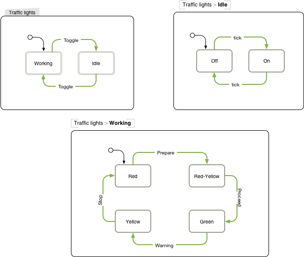

# traffic-lights

A [re-frame](https://github.com/Day8/re-frame) application designed to show simple example of using statecharts.

Traffic lights works in 2 modes:
- idle (yellow light is blinking)
- working (red/yellow/green changes according to mode)

Use can toggle between idle and working by pressing button. Internal statemachine uses timers to transition between modes.



## Development Mode

### Run application:

```
lein clean
lein figwheel dev
```

Figwheel will automatically push cljs changes to the browser.

Wait a bit, then browse to [http://localhost:3449](http://localhost:3449).

## Production Build


To compile clojurescript to javascript:

```
lein clean
lein cljsbuild once min
```
